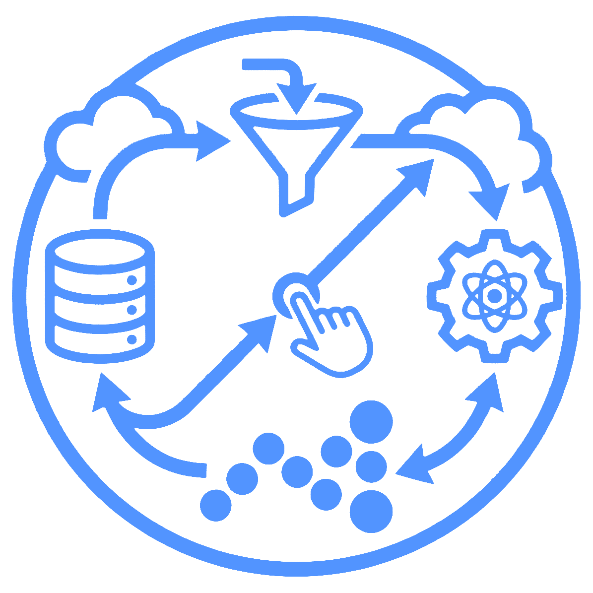
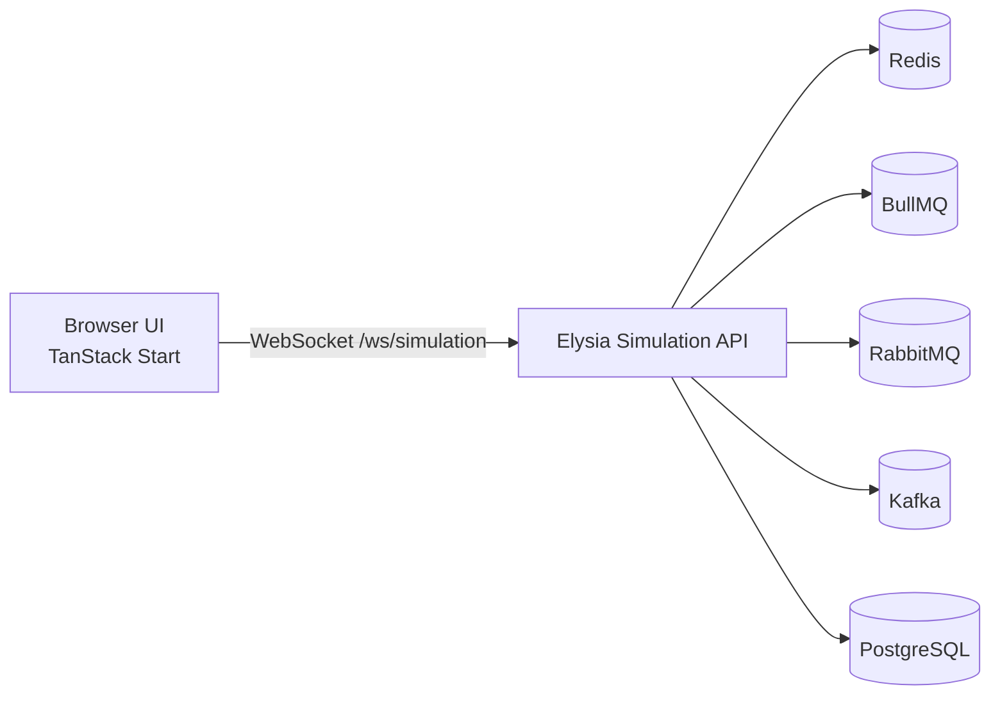

# System Visualizer

<p align="left">
  
</p>

Interactive distributed-systems learning platform with real infrastructure in the loop. The app visualizes live flows across Redis, BullMQ, RabbitMQ, Kafka, and PostgreSQL while scenarios run through an Elysia backend and stream events over WebSocket.

## What You Get

- Real backend operations, not mocked traces
- Animated scenario flows with phase stepping and replay controls
- Learn section with glossary and deep links into scenario phases
- Event log + metrics + scenario comparison recap
- Production container stack with optional Caddy reverse proxy

## Tech Stack

- Frontend: TanStack Start, TanStack Router, React 19, Tailwind v4, XYFlow
- Backend: Elysia on Bun, Redis, BullMQ, RabbitMQ, Kafka, PostgreSQL
- Monorepo: Bun workspaces (`apps/web`, `apps/server`, `packages/shared`)

## Architecture



## Repository Layout

```text
visualizer/
  apps/
    web/        # Frontend app (TanStack Start)
    server/     # Simulation backend (Elysia)
  packages/
    shared/     # Shared event/types contracts
  docker-compose.yml        # Local infra (dev)
  docker-compose.prod.yml   # Production stack (apps + infra + caddy)
```

## Local Development

### 1) Prerequisites

- Bun 1.3.11+
- Docker + Docker Compose

### 2) Install Dependencies

```bash
bun install
```

### 3) Configure Environment

```bash
cp .env.example .env
```

Default local values already work for development.

### 4) Start Local Infrastructure

```bash
docker compose up -d
```

This starts PostgreSQL, Redis, RabbitMQ, and Kafka.

### 5) Run Apps (Two Terminals)

Terminal A:

```bash
bun run dev:server
```

Terminal B:

```bash
bun run dev:web
```

Web app: `http://localhost:3000`

Server health: `http://localhost:3001/health`

## Typecheck & Build

Typecheck all packages:

```bash
bun run typecheck
```

Build all packages:

```bash
bun run build
```

## Production Compose

Use the production compose file to run full stack containers, including frontend and backend images.

```bash
docker compose -f docker-compose.prod.yml --env-file .env up -d --build
```

Services:

- Caddy reverse proxy on ports 80/443
- Web app behind Caddy
- WebSocket proxy at `/ws/*` to backend

See [docs/deploy-vps-caddy.md](docs/deploy-vps-caddy.md) for VPS deployment details.

## Environment Variables

See [.env.example](.env.example) for the full template.

Key variables:

- `POSTGRES_URL`, `REDIS_URL`, `RABBITMQ_URL`, `KAFKA_BROKERS`, `SERVER_PORT`
- `VITE_SIMULATION_WS_URL` (for client WebSocket endpoint)
- `APP_DOMAIN`, `CADDY_EMAIL` (production reverse proxy)

## Screenshots

Add product screenshots under [docs/screenshots](docs/screenshots) and reference them here.

Suggested captures:

- Landing page
- Scenario canvas during active flow
- Learn glossary and concept page
- Summary/comparison card

## Demo GIF / Video

Use [docs/demo-capture.md](docs/demo-capture.md) for a quick recording workflow.

## License

Private project for educational/product development.
